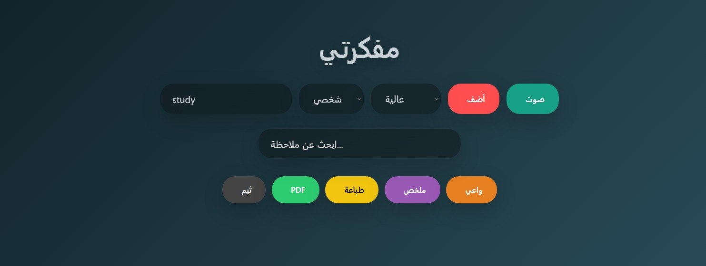

# My Notebook 

My Ultra Notebook is an advanced, interactive web-based journaling and note-taking app. It offers mood analysis, voice input, PDF export, printing, and a daily mood summary with charts. Designed with a modern aesthetic and responsive design, it's perfect for personal, work, or study notes.

---

## 📌 Features

- Add notes with:
  - Text input
  - Voice recognition
  - Category: Personal, Work, Study
  - Priority: Low, Medium, High
- Mood detection automatically analyzes note content:
  - Happy, Sad, Angry, Anxious, Neutral
- Toggle **Mindful Mode** to enforce positive phrasing
- Mark notes as completed
- Search notes in real-time
- Export all notes as **PDF**
- Print notes directly from the browser
- Show **daily mood summary** via interactive Chart.js doughnut chart
- Light/Dark theme toggle (auto based on time or manual)
- Responsive design for mobile and desktop

---

## 🛠️ Technologies Used

- HTML5 + CSS3 (Flexbox & Grid)
- JavaScript (ES6+)
- LocalStorage for note saving
- Chart.js for mood summary
- jsPDF for PDF export
- SweetAlert2 for alerts and prompts
- Google Fonts: Inter
- Font Awesome icons

---

## ⚡ How to Use

1. Open `index.html` in your browser.
2. Add a note using the input box.
3. Optionally select category and priority.
4. Use the voice input button to add notes by speaking.
5. Toggle themes or activate Mindful Mode.
6. View mood summary with the chart button.
7. Export notes as PDF or print them directly.

